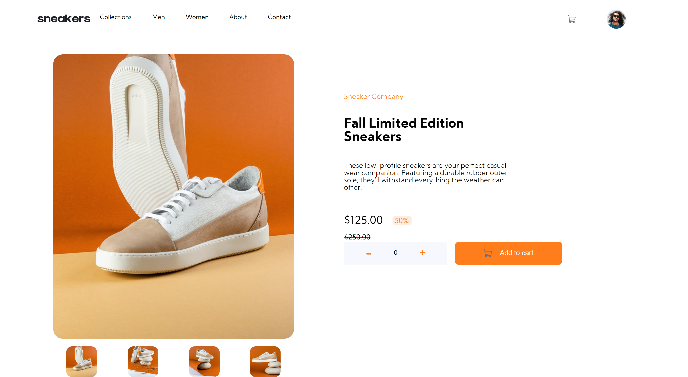

# Frontend Mentor - E-commerce product page 

### Desafio:

- Ver de forma otimizada conforme aparelho
- Efeito de hover para os elementos da página
- Abrir uma pequena galeria ao clicar na imagem principal
- Trocar de imagem clicando na tumb de cada produto
- Adicionar itens do carrinho
- Ver o carrinho e remover itens

## Processo

### Feito com:

- HTML5
- CSS
- Flexbox
- CSS Grid
- JavaScript

### Aprendizado

- Melhora do entendimento de Flexbox e grid
- Melhora do entendimento sobre responvidade e mediaQueries
- Aprendendo a lidar melhor com imagens.

### Observações futuras

- Melhorar a organização do código
- Implementar JavaScript mais avançado
- Procurar escrever de forma mais eficiente

## Autor

- Linkedin - (https://www.linkedin.com/in/guilherme-louren%C3%A7o-lopes-81650b215/)
